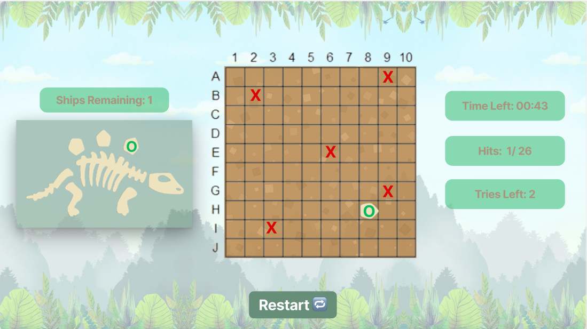

# 🦴Fossil Prospector🦖




##  Description 🔍
**Fossil Prospector** is a grid-based excavation game inspired by *Battleship*. In a 10x10 grid, you take on the role of an adventurous paleontologist who must find fossil parts buried across various regions in a race against time and before the available tries finish. Your goal is to locate every fossil fragment needed to finish the dinosaur skeleton before the clock runs out or the tries finish!

## How to Get Started and Play 🎮
* The moment the page loads, the game launches automatically.
* Click on any tile in the 10x10 excavation grid to dig.
* The countdown time will start
    * If a fossil portion is found, it will be visually identified.
    * It will display as a miss if you hit plain dirt.
* Your current score and fossil discoveries are displayed in the side panel
* Finding every fossil component before:
    * Time runs out  
    *and*
    * The available tries finish
* A win message will appear *only if you locate all fossil parts before time ends and before the available tries finish*
* The **Restart** button will allow you to restart the game.

##  Planning Materials 📁
* [Trello Board](https://trello.com/invite/b/686e9621eb4668b4c8cb0c12/ATTI1c8232b6e9c46555e5bd3a68bd8e983e6F8161F4/🦴fossil-prospector🦖-battleship)
* [Wireframe](https://www.figma.com/slides/VUNyLMwxTZUuVyMNhdXG0o/Untitled?node-id=0-1&t=1b8QBUwrE9yYXjvy-1)
* Pseudocode:
```js
// Pseudocode Overview
- Generate 10x10 grid  
- Randomly place multi-cell fossil parts  
- On dig: check if cell matches fossil location  
- Show hit/miss result visually  
- Track fossil parts found and score  
- Win = all parts uncovered before time ant tries
```
* plaintext:
```
1. Initialize empty 10x10 grids for player and computer
2. Place fossil of different sizes on each grid
   - Ensure no overlaps or out-of-bounds placements
3. Player clicks on computers grid to attack
   - If hit: mark hit, show feedback
   - If miss: mark miss, change turn
4. Game ends when one all fossil found = win, or tries finsh || time out = loss
```

## Game Logic 🧠

1. When the game loads:
   - Generate and display a 10x10 excavation grid
   - Randomly place multi-cell fossil parts on hidden tiles

2. Fossil placement:
   - Choose fossil sizes (e.g., 2–5 tiles long)
   - Place fossils without overlapping or going out of bounds

3. On player dig (click):
   - Check if the clicked cell contains a fossil part
   - If yes:
     - Mark as hit
     - Update fossil tracker and increase score
   - If no:
     - Mark as miss
   - Prevent digging the same cell twice

4. Win condition:
   - If all fossil parts are found before time runs out and before the  available tries finish:
     - Display win message and stop the game

5. Lose condition:
   - If time runs out or the available tries finish:
     - Display lose message and stop the game

6. Restart:
   - Clear board, reset score, fossils, and timer
   - Start a new game


## Future Features 🚀
* Add a two-player mode (user vs. computer)
* Both take turns digging on their own grid
* First to find all fossil parts wins
* Display turn-based status and animations
* Add sound effects for hits, misses, win/lose, and countdown

***The future feature has been applied in the new repositorie [Fossil-Prospector-2players](https://github.com/ayahalij/Fossil-Prospector-2players)***


##  Credits 🙏🏻

* 📝✍🏻 **Planning & Task Management**: [Trello](https://trello.com) used for organizing phases, tasks, and progress.
* 🎨🧱 **Wireframe & Layout Design**: Created using [Figma](https://www.figma.com/) for visual planning and layout structure.
* 👁‍🗨🔧 **Graphics Editing**: [Pixlr](https://pixlr.com/) used for customizing images and visual assets.
* 🔤📎 **Typography**: [Freckle Face](https://fonts.google.com/specimen/Freckle+Face) from Google Fonts — playful, prehistoric style.
* 💻🌐 **Code References & Learning Support**:
  - [W3Schools](https://www.w3schools.com/)
  - [MDN Web Docs (Mozilla)](https://developer.mozilla.org/)
  - [Stack Overflow](https://stackoverflow.com/)

* 🤍👥 **Instructional Support**: Thanks to General Assembly instructors for feedback, guidance, and support throughout the development process.


